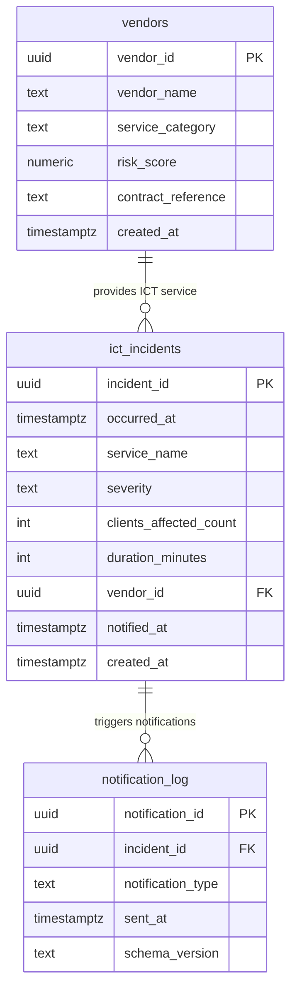

# Project 2: First Compliance Queries

> Schema for the three core compliance tables, a script to generate fake data with Faker, and eight SQL queries that answer actual DORA/NIS2 reporting questions.

This is the foundation everything else builds on. The schema is pretty straightforward — vendors provide ICT services, incidents happen, notifications get sent. The interesting part is writing queries that actually answer the questions a compliance officer would ask, not just "SELECT * WHERE severity = 'critical'".

The fake data generator creates 50 vendors and 10,000 incidents with realistic distributions — not all critical, not all the same vendor, timestamps spread over time. Boring fake data produces boring query results.

## Schema

## Queries built

| File | What it answers |
|------|----------------|
| `01_critical_incidents_last_30_days.sql` | Daily triage — what's still active and critical |
| `02_count_by_severity.sql` | Severity breakdown for DORA reporting |
| `03_incidents_with_no_notification.sql` | Compliance gap: incidents that never got reported |
| `04_top_10_vendors_by_incident_count.sql` | Which vendors are causing the most problems |
| `05_average_duration_per_service.sql` | Baseline for how long outages normally last |
| `06_incidents_over_1000_clients_affected.sql` | DORA "major incident" candidates |
| `07_vendors_high_risk.sql` | Vendors that need closer monitoring |
| `08_incidents_on_weekends.sql` | Are we handling weekend incidents differently? |

## Code

| Path | Description |
|------|-------------|
| [`migrations/001_initial.sql`](../migrations/001_initial.sql) | Schema DDL |
| [`generate_data.py`](../generate_data.py) | Faker-based synthetic data generator |
| [`queries/01_*.sql` – `08_*.sql`](../queries/) | Eight compliance queries |
| [`db.py`](../db.py) | psycopg2 connection helper |
