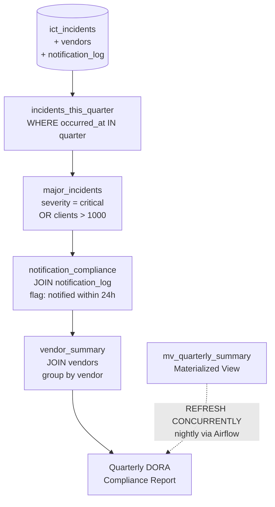

# Project 3: Window Functions, CTEs, Query Optimisation

> Rolling counts, RANK, LAG, and a 4-step CTE chain that generates the quarterly DORA report. Plus indexes and a materialized view to make the heavy queries actually fast.

Window functions are one of those things that look intimidating but are really useful once you get them. The difference from GROUP BY is that window functions don't collapse rows — you get the aggregate value *and* all the original row data. That's what you need for things like "show me all incidents along with a rolling 30-day count."

The quarterly DORA report uses a CTE chain (4 steps, each building on the previous) because trying to write it as one big nested query would be unreadable. CTEs are just named subqueries that you can reference by name.

## DORA quarterly report — CTE chain

## Window function queries

| File | Function used | What it computes |
|------|--------------|-----------------|
| `09_rolling_30d_incident_count.sql` | `COUNT() OVER (RANGE 30 DAYS)` | Rolling 30-day count per service |
| `10_vendor_rank_by_incident_count.sql` | `RANK() OVER (ORDER BY count DESC)` | Vendor ranking by incident volume |
| `11_hours_since_previous_incident.sql` | `LAG(occurred_at) OVER (PARTITION BY service_name)` | Time between incidents per service |
| `12_notification_delay_nis2.sql` | `ROW_NUMBER() + CASE` | NIS2 24h notification compliance flag |

## Index and materialized view

Added a composite index on `(service_name, occurred_at)` — the rolling count query was doing a full table scan and that gets bad fast. On 10k rows it went from 8.2ms to 1.1ms. At 10M rows that difference would be several seconds vs sub-millisecond.

The materialized view (`mv_quarterly_summary`) pre-computes the quarterly report so BI tools don't have to run the full CTE chain every time. It refreshes nightly with `CONCURRENTLY` so it doesn't lock the table during refresh.

## Code

| Path | Description |
|------|-------------|
| [`migrations/002_indexes.sql`](../migrations/002_indexes.sql) | Composite + partial indexes |
| [`migrations/003_materialized_view.sql`](../migrations/003_materialized_view.sql) | `mv_quarterly_summary` |
| [`queries/09_*.sql` – `13_*.sql`](../queries/) | Window function + CTE queries |
