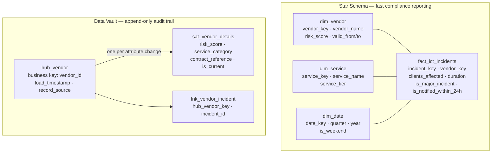

# Project 4 + 5: Star Schema, Data Vault, and SCD Types

> A Kimball star schema for fast DORA reporting queries, plus a Data Vault structure for the vendor register that keeps full history. Three different SCD types depending on what needs to be tracked.

Two different modeling approaches for two different problems. The star schema is optimised for reading — the DORA quarterly report runs in milliseconds because it just joins a fact table to a few dimension tables. The Data Vault is optimised for auditability — every change to a vendor's risk score is kept forever because DORA Art. 28 requires that.

SCD stands for Slowly Changing Dimension — it's just the pattern for how you handle data that changes over time. Different entities need different approaches.

## Schema model

## Which SCD type for what

| Entity | SCD Type | Why |
|--------|----------|-----|
| Vendor risk scores | Type 2 (Data Vault Satellite) | DORA Art. 28 requires full history — can't overwrite |
| Service display names | Type 1 (overwrite) | Just a label, no regulatory significance |
| Vendor risk score delta | Type 3 (prev + current columns) | Quick "did this get worse" check without querying history |
| Compliance config thresholds | Type 4 (current + history tables) | Fast lookup for current value, separate audit trail |

Type 2 is the most common — you add `valid_from` and `valid_to` columns and insert a new row instead of updating. The old row stays with `valid_to = now()`. The Data Vault Satellite is basically Type 2 with some extra structure.

## Code

| Path | Description |
|------|-------------|
| [`migrations/004_star_schema.sql`](../migrations/004_star_schema.sql) | Fact and dimension tables |
| [`migrations/005_data_vault.sql`](../migrations/005_data_vault.sql) | Hub, Satellite, Link tables |
| [`migrations/006_scd.sql`](../migrations/006_scd.sql) | SCD Type 3 + Type 4 tables |
| [`queries/15_vendor_risk_increased.sql`](../queries/15_vendor_risk_increased.sql) | Risk delta detection (SCD Type 3) |
| [`queries/16_config_at_date.sql`](../queries/16_config_at_date.sql) | Point-in-time config audit (SCD Type 4) |
