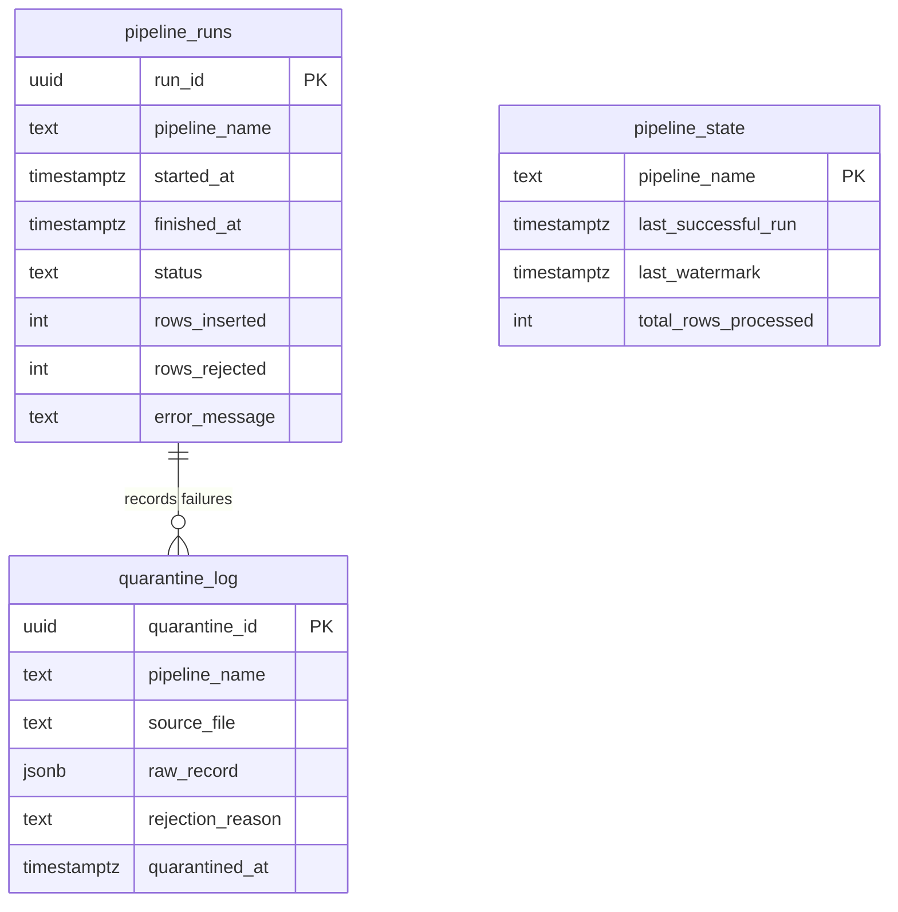

# Project 6: Batch Ingestion — Schema and Pipeline State

> Schema additions to support the batch ingestion pipelines: a table to track pipeline runs, a table to store watermarks (last successfully loaded timestamp), and a quarantine log for rejected records.

The ingestion pipelines themselves live in `finanzwerk-airflow`. This is just the warehouse side — the tables that the pipelines write to for observability and state.

## Pipeline support tables

The watermark pattern is how incremental loading works. `pipeline_state.last_watermark` stores the `MAX(occurred_at)` from the last successful load. Next run, the ingestion query adds `WHERE occurred_at > last_watermark`. Simple and effective — no external state management needed.

The quarantine log stores rejected records as JSONB so you can inspect them later and figure out what went wrong. Bad records don't get discarded, they get parked.

## Code

| Path | Description |
|------|-------------|
| [`migrations/007_pipeline_state.sql`](../migrations/007_pipeline_state.sql) | Pipeline support tables DDL |
| [`queries/17_pipeline_health.sql`](../queries/17_pipeline_health.sql) | Pipeline run summary and error rates |
| [`queries/18_quarantine_summary.sql`](../queries/18_quarantine_summary.sql) | Quarantined record analysis |
