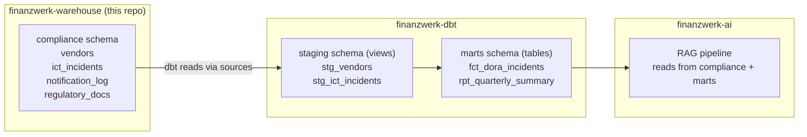

# Project 13: dbt Transformation Layer (Warehouse)

> dbt runs against the same PostgreSQL database but writes to a separate `marts` schema. The warehouse owns `compliance.*` (operational tables). dbt owns `marts.*` (reporting tables).

The schema separation matters because it makes ownership clear. If something breaks in the `compliance` schema, it's a warehouse/ingestion problem. If something breaks in `marts`, it's a dbt problem. No stepping on each other.

## Schema ownership

## What lives where

If it's a `SELECT` with no side effects → dbt (marts schema).  
If it writes operational data (ingestion, upsert, watermarks) → warehouse Python scripts.

The warehouse migrations are the only thing that changes the `compliance` schema. dbt never writes there. This means you can run dbt as a read-only user against the compliance schema.

## Code

| Path | Description |
|------|-------------|
| [`migrations/`](../migrations/) | All DDL (compliance schema only) |
| [`queries/`](../queries/) | Ad-hoc compliance SQL, not managed by dbt |
