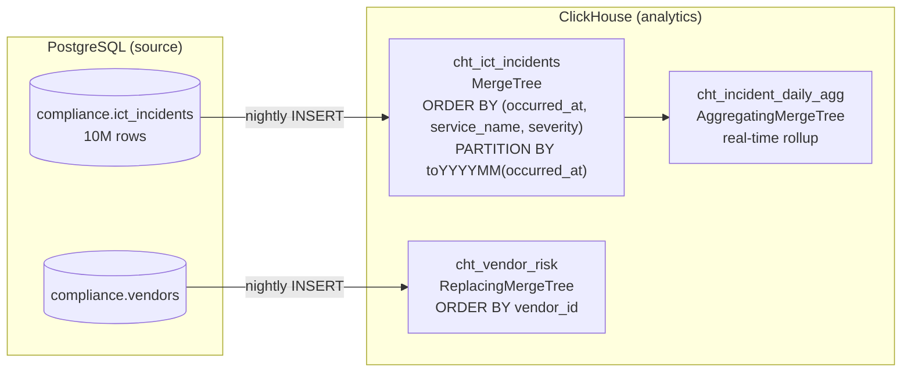

# Project 24: ClickHouse Analytics Layer

> ICT incidents and vendor data synced from PostgreSQL to ClickHouse nightly. Three analytical queries that show what you can do with ClickHouse that would be too slow in PostgreSQL.

ClickHouse stores data by column instead of by row. For a query like "count all incidents grouped by severity and quarter", PostgreSQL reads every column of every row even though it only needs two columns. ClickHouse reads only those two columns. On 10M rows that difference is massive.

## Table design

The `ORDER BY (occurred_at, service_name, severity)` on `cht_ict_incidents` is the sort key — ClickHouse physically stores rows in this order. A query filtering by date range + service skips entire chunks of data without reading them. It's basically the equivalent of a clustered index but much more aggressive.

## Query performance comparison

| Query | PostgreSQL | ClickHouse |
|-------|-----------|-----------|
| `21_clickhouse_rolling_trend.sql` (30-day rolling by service) | ~8s on 10M rows | ~0.04s |
| `22_clickhouse_vendor_performance.sql` (full vendor history) | ~12s | ~0.06s |
| `23_clickhouse_cross_quarter.sql` (cross-quarter breakdown) | ~6s | ~0.02s |

## Code

| Path | Description |
|------|-------------|
| [`queries/21_clickhouse_rolling_trend.sql`](../queries/21_clickhouse_rolling_trend.sql) | Rolling trend |
| [`queries/22_clickhouse_vendor_performance.sql`](../queries/22_clickhouse_vendor_performance.sql) | Vendor performance history |
| [`queries/23_clickhouse_cross_quarter.sql`](../queries/23_clickhouse_cross_quarter.sql) | Cross-quarter aggregate |
