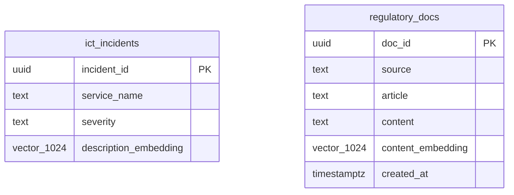

# Project 32: pgvector — Schema and SQL


> Migration `012_pgvector.sql` adds the vector extension, a 1024-dimension embedding column to `ict_incidents`, a table for regulatory document chunks, and HNSW indexes on both. Two query files show semantic and hybrid search patterns.

This is the warehouse side of the pgvector work. The actual embedding generation and RAG pipeline live in `finanzwerk-ai`. Here it's just the schema and the raw SQL queries that talk to the vector index.

## Schema additions



## HNSW index — what the parameters mean

```sql
CREATE INDEX ON compliance.ict_incidents
    USING hnsw (description_embedding vector_cosine_ops)
    WITH (m=16, ef_construction=64);
```

`m=16` — each node in the graph connects to 16 neighbours. Higher = better recall but more memory.  
`ef_construction=64` — how many candidates to consider when building the index. Higher = better quality, slower build.  
`vector_cosine_ops` — use cosine similarity (`<=>` operator). Voyage-3 embeddings are normalized so cosine is correct here.

At 10k incidents, the HNSW index drops query time from ~3ms (flat scan) to ~0.1ms. The gap grows fast with more data.

## Queries

| File | What it does |
|------|-------------|
| [`queries/19_semantic_search.sql`](../queries/19_semantic_search.sql) | Find similar incidents and relevant regulatory articles by embedding |
| [`queries/20_semantic_vs_keyword.sql`](../queries/20_semantic_vs_keyword.sql) | Side-by-side: keyword-only vs vector-only vs hybrid (RRF) |

## Code

| Path | Description |
|------|-------------|
| [`migrations/012_pgvector.sql`](../migrations/012_pgvector.sql) | Extension, columns, indexes |
